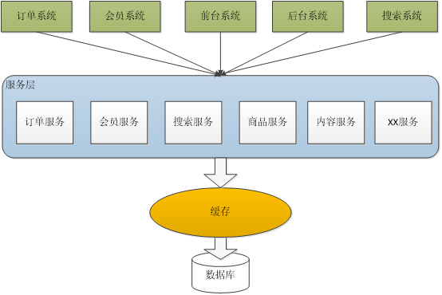
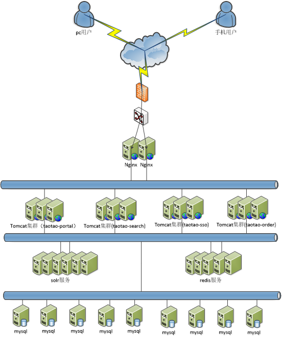

# Distributed-Mall
Java Project--Build a distributed e-mall
### Architecture

### Network Topology 

### System Deployment
#### Deplyment Analysis
- e3-manager
- e3-manager-web
- e3-portal-web
- e3-content
- e3-search
- e3-search-web
- e3-item-web
- e3-sso
- e3-sso-web
- e3-cart-web
- e3-order
- e3-order-web
#### Server Planning

----------

- Mysql						    2
- Solr								7
- Redis							    6
- Picture Server 					    2
- Nginx							    2
- Registry Center						    3
- Activemq							2

----------
#### Domain Name Planning 
| Num | Project Name | Domain Name |
| ------ | ------ | ------ |
| 1 | e3-manager-web | manager.e3mall.cn |
| 2 | e3-portal-web | www.e3mall.cn |
| 3 | e3-search-web | search.e3mall.cn |
| 4 | e3-item-web | item.e3mall.cn |
| 5 | e3-sso-web | sso.e3mall.cn |
| 6 | e3-cart-web | cart.e3mall.cn |
| 7 | e3-order-web | order.e3mall.cn |

#### Tomcat Deplyment
